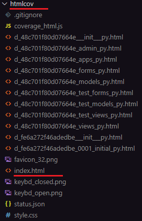

## To run the coverage report
First you need to install it, write the codes below in the terminal

```
pip3 install coverage
```

Then run it to make a report<br>
**(Do this step over again, when you create new tests!)**<br>
*"todo" here, is my folder name which holds the manage.py and test files.*

```
coverage run --source=todo manage.py test
```

To write the report
```
coverage report
```

For my test during this time, this is the output
```
Name                              Stmts   Miss  Cover
-----------------------------------------------------
todo/__init__.py                      0      0   100%
todo/admin.py                         3      0   100%
todo/apps.py                          4      0   100%
todo/forms.py                         6      0   100%
todo/migrations/0001_initial.py       5      0   100%
todo/migrations/__init__.py           0      0   100%
todo/models.py                        6      1    83%
todo/test_forms.py                   14      0   100%
todo/test_models.py                   6      0   100%
todo/test_views.py                   37      0   100%
todo/views.py                        35      0   100%
-----------------------------------------------------
TOTAL                               116      1    99%
```

I will write a test to for the last thing that was not tested in this case.
Here is the output when doing the report again, when a new test was added to **test_models.py**
```
coverage report
```

```
Name                              Stmts   Miss  Cover
-----------------------------------------------------
todo/__init__.py                      0      0   100%
todo/admin.py                         3      0   100%
todo/apps.py                          4      0   100%
todo/forms.py                         6      0   100%
todo/migrations/0001_initial.py       5      0   100%
todo/migrations/__init__.py           0      0   100%
todo/models.py                        6      1    83%
todo/test_forms.py                   14      0   100%
todo/test_models.py                   9      3    67%
todo/test_views.py                   37      0   100%
todo/views.py                        35      0   100%
-----------------------------------------------------
TOTAL                               119      4    97%
```

To fix it run this now
```
coverage run --source=todo manage.py test
```

And when I run
```
coverage report

```
Again, this is the output that I recived
```

Name                              Stmts   Miss  Cover
-----------------------------------------------------
todo/__init__.py                      0      0   100%
todo/admin.py                         3      0   100%
todo/apps.py                          4      0   100%
todo/forms.py                         6      0   100%
todo/migrations/0001_initial.py       5      0   100%
todo/migrations/__init__.py           0      0   100%
todo/models.py                        6      0   100%
todo/test_forms.py                   14      0   100%
todo/test_models.py                   9      0   100%
todo/test_views.py                   37      0   100%
todo/views.py                        35      0   100%
-----------------------------------------------------
TOTAL                               119      0   100%
```

## More indepth of what happend
If you want to know what was not tested, you can write the coverage report to display in **HTML** instead so you can view it more accurate.
For that I will delete my last test and go through it again.

Write this code here in the terminal as you did the others.
```
coverage html
```

This will create a new folder called **htmlcov**, and within it you will have an **index.html**



To view this file in the browser you need to write this code in the terminal.

```
python3 -m http.server
```

Press on Open Browser


Look for **htmlcov** and press on it.


Now you can press on the onces you are missing, which in my case is in **todo/model.py**
Which looks like this for my case.


Now that I know what is not tested, I can go to my test file and write the code to fix this.

```python
def test_item_string_methods_returns_name(self):
    item = Item.objects.create(name='Test Todo Item')
    self.assertEqual(str(item), 'Test Todo Item')
```

And now when that's done, and I know its a pass on the test. I can run the create report again.<br>
*If you "coverage report" here, you will get miss on models.py and test_models.py files again as we mentioned earlier.*
```
coverage run --source=todo manage.py test
```
And after that you can run:
```
coverage report
```
Output:
```
Name                              Stmts   Miss  Cover
-----------------------------------------------------
todo/__init__.py                      0      0   100%
todo/admin.py                         3      0   100%
todo/apps.py                          4      0   100%
todo/forms.py                         6      0   100%
todo/migrations/0001_initial.py       5      0   100%
todo/migrations/__init__.py           0      0   100%
todo/models.py                        6      0   100%
todo/test_forms.py                   14      0   100%
todo/test_models.py                   9      0   100%
todo/test_views.py                   37      0   100%
todo/views.py                        35      0   100%
-----------------------------------------------------
TOTAL                               119      0   100%
```

***Now that is all done, may the code be with you!***